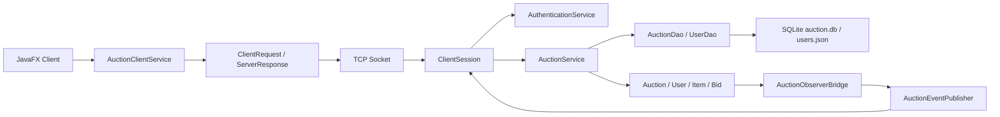

# Auction House - Huong dan hoc va bao ve bai

Du an nay la he thong dau gia theo kien truc client-server. Client dung JavaFX/FXML de hien thi giao dien, server xu ly nghiep vu dau gia, quan ly nguoi dung, dong bo nhieu client va luu du lieu.

Tai lieu nay giup ban hoc theo dung yeu cau de bai: protocol ung dung, client-server, concurrency, OOP, design pattern, realtime update va persistence.

## 1. Nen doc file nao truoc

Nen hoc theo thu tu:

1. `README.md`: nam muc tieu, cach chay va cach on.
2. `note.md`: hoc OOP, cay ke thua, design pattern va bang cham diem.
3. `flow.md`: hoc luong chay khi bam nut, ham nao goi ham nao, du lieu luu o dau.
4. Code theo module:
   - `auction-shared`: model, DTO, request/response protocol.
   - `auction-server`: server socket, service, DAO, event, persistence.
   - `auction-client`: JavaFX controller, FXML, client socket service.

## 2. Muc tieu cua de bai

De bai yeu cau xay dung he thong dau gia co nhieu client ket noi den server. Moi client co the tao phien dau gia, tham gia dau gia, dat gia, xem gia cao nhat va nhan thong bao khi gia/trang thai thay doi.

Cac muc tieu can nam:

- Thiet ke protocol tang ung dung.
- Xay dung chuong trinh client-server.
- Chon giao thuc transport phu hop.
- Hieu concurrency trong he thong nhieu client.
- Tach bai toan lon thanh module nho.
- Co xu ly loi, test, convention va CI.

## 3. Kien truc tong quat



Ngan gon:

- Client chi nhan input va hien thi ket qua.
- Server moi la noi xu ly nghiep vu that.
- Protocol ung dung la cac object `ClientRequest` va `ServerResponse`.
- Transport layer dung TCP socket vi dau gia can ket noi tin cay, co thu tu va it mat goi.

## 4. Cach du an dap ung yeu cau de bai

| Yeu cau de bai | Trong du an hien tai |
| --- | --- |
| Client ket noi server | `AuctionClientService.ensureConnected()` tao socket den server |
| Advertise item for auction | `SellerController.createAuction()` -> `AuctionService.createAuction()` |
| List active auctions | `DashboardController.loadDashboard()` -> `AuctionService.loadDashboard()` |
| Register/subscribe auction | `AuctionDetailController.subscribeAndRender()` -> `ClientSession.handleSubscribe()` |
| Place bid | `AuctionDetailController.placeBid()` -> `AuctionService.placeBid()` -> `Auction.placeBid()` |
| Check highest bid | `AuctionView.highestBid`, `AuctionDetailController.renderAuction()` |
| Close auction | `Auction.closeAuction()`, `AuctionService.finishAuction()`, auto close scheduler |
| Notify participants | `AuctionObserverBridge` -> `AuctionEventPublisher` -> socket event |
| Error control | custom exceptions + `ServerResponse.error()` |
| Protocol design | `CommandType`, request records, `ClientRequest`, `ServerResponse` |
| Concurrency | `ReentrantLock` theo auction, `synchronized placeBid()`, concurrent collections |

## 5. Cac module chinh

### `auction-shared`

Dung chung cho client va server:

- Domain model: `Auction`, `Item`, `User`, `Bid`.
- Subclass: `Bidder`, `Seller`, `Admin`, `Electronics`, `Art`, `Clothing`.
- Protocol: `ClientRequest`, `ServerResponse`, `BidRequest`, `LoginRequest`, ...
- DTO: `AuctionView`, `DashboardView`, `UserView`.

### `auction-server`

Xu ly server:

- `AuctionServer`: mo server socket va accept client.
- `ClientSession`: moi client la mot session, doc request va dispatch theo `CommandType`.
- `AuthenticationService`: login/register.
- `AuctionService`: nghiep vu dau gia, tao/sua/xoa/start/bid/pay.
- `AuctionManager`: singleton quan ly lock, auto-bid, session va auction registry.
- `SqliteAuctionDao`: luu auction, item, bid history vao SQLite.
- `FileBackedUserDao`: luu user va balance vao JSON.

### `auction-client`

Xu ly UI:

- FXML view: login, register, dashboard, auction detail, seller, account.
- Controller: bat su kien nut bam, goi service, cap nhat UI.
- `AuctionClientService`: gui request qua socket va lang nghe realtime event.
- `SessionModel`: state tam cua man hinh.
- `AppCoordinator`: dieu huong giua cac man hinh.

## 6. Design pattern can hoc

Hoc ky cac pattern sau vi day la phan de bi hoi khi bao ve:

- MVC: FXML la View, Controller xu ly UI, `SessionModel` giu state, DAO nam o server.
- Singleton: `AuctionManager.getInstance()` dung chung lock, auto-bid rule, auction registry.
- Observer: `Auction` notify, `AuctionObserverBridge` luu DB va publish event.
- Factory: `ItemFactory` tao `Electronics`, `Art`, `Clothing` theo `ItemType`.
- DAO/Repository: `AuctionDao`, `UserDao` tach service khoi SQLite/JSON.
- DTO/Protocol: client-server khong truyen lung tung, ma truyen request/response co cau truc.

Doc chi tiet trong `note.md`.

## 7. Luong chay can thuoc

### Login

`LoginController.handleLogin()` -> `AuctionClientService.login()` -> `ClientRequest(LOGIN)` -> `ClientSession.handleLogin()` -> `AuthenticationService.login()` -> `UserDao.findById()` -> `ServerResponse.success(UserView)`.

### Load dashboard

`DashboardController.loadDashboard()` -> `AuctionClientService.loadDashboard()` -> `ClientSession.handleDashboard()` -> `AuctionService.loadDashboard()` -> `AuctionDao.findVisibleAuctions()` -> `AuctionViewMapper.toDashboard()` -> render UI.

### Dat gia

`AuctionDetailController.placeBid()` -> `AuctionClientService.placeBid()` -> `ClientSession.handleBid()` -> `AuctionService.placeBid()` -> `AuctionManager.lockForAuction()` -> `Auction.placeBid()` -> `AuctionObserverBridge.update()` -> save DB + push realtime event.

### Realtime update

`Auction.notifyObservers()` -> `AuctionObserverBridge.update()` -> `AuctionEventPublisher.publishToAuction()` -> `ClientSession.onAuctionEvent()` -> `AuctionClientService.listenForResponses()` -> controller update UI bang `Platform.runLater()`.

Doc day du trong `flow.md`.

## 8. Noi luu du lieu

- Auction, item, highest bid, bid history: SQLite file `auction.db`.
- User, role, password, balance: JSON file `users.json`.
- Port server dang chay: `active-port.txt`.
- State tam tren client: `SessionModel`, khong persist.
- Auto-bid rule: RAM server trong `AuctionManager`, khong persist.

## 9. Cach chay du an

Yeu cau:

- JDK 21.
- Maven.

Chay test:

```powershell
mvn test
```

Compile:

```powershell
mvn -DskipTests compile
```

Chay server:

```powershell
mvn -pl auction-server -Prun-server process-classes
```

Chay client:

```powershell
mvn -pl auction-client -Prun-client process-classes
```

Neu port mac dinh `5050` ban, server se tu tim port tiep theo va ghi vao `active-port.txt`.

Tai khoan mau thuong dung:

- `bidder01 / bidder01`
- `bidder02 / bidder02`
- `seller01 / seller01`
- `admin01 / admin01`

## 10. Cach on de bao ve

Tra loi theo mau ngan gon:

- OOP: `User` va `Item` la abstract class; cac role/item type ke thua; field private de encapsulation; interface DAO/Observer de abstraction.
- Client-server: client gui `ClientRequest` qua TCP socket, server `ClientSession` xu ly va tra `ServerResponse`.
- Protocol: `CommandType` la lenh, payload la request record, response co status/message/payload.
- Concurrency: moi auction co lock rieng, nen nhieu client bid cung luc khong lam sai gia.
- Realtime: `Auction` thay doi thi observer save DB va publisher push event ve client.
- Persistence: auction luu SQLite, user/balance luu JSON.
- Design pattern quan trong: Singleton, Observer, Factory, DAO, MVC.

## 11. Diem theo rubric

Du an co the trinh bay la:

- Bat buoc: `10/10`.
- Tuy chon: co Auto-Bidding, Anti-sniping, Bid History Visualization.
- Neu rubric gioi han tong `10+1`, diem trinh bay la `10/10 + 1/1`.

Bang cham chi tiet nam trong `note.md`.
