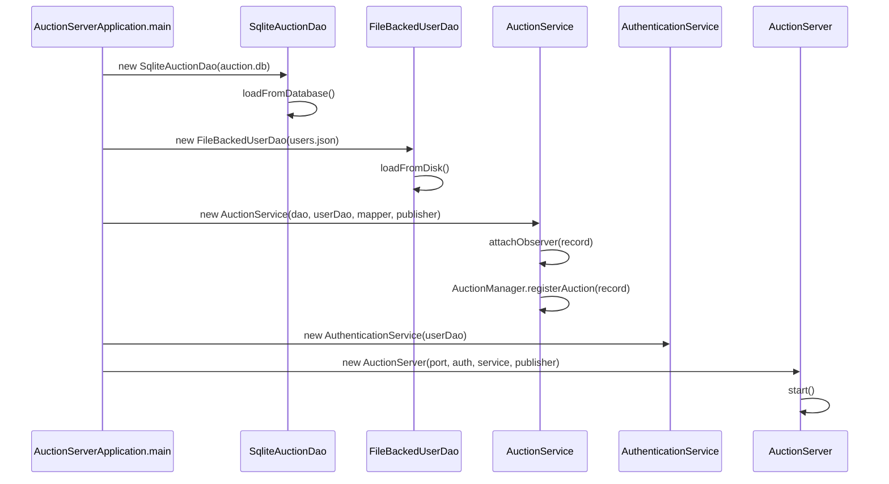
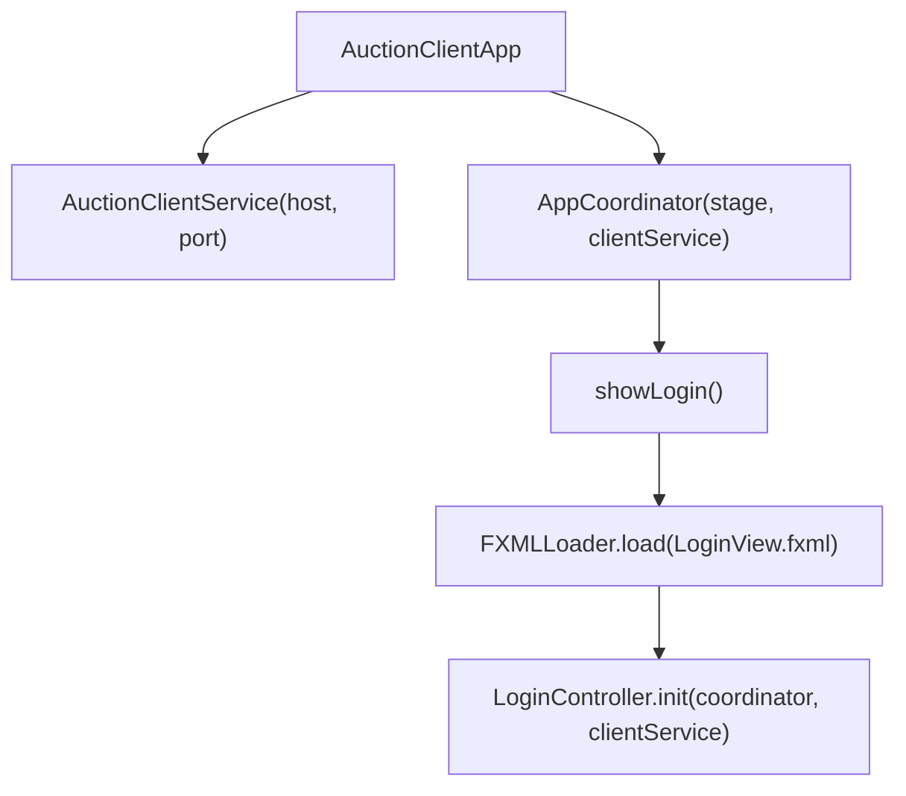
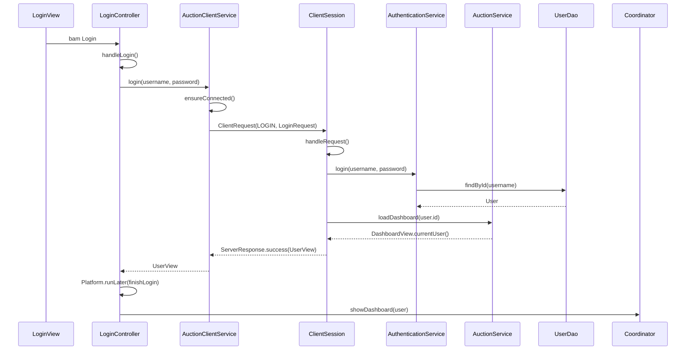
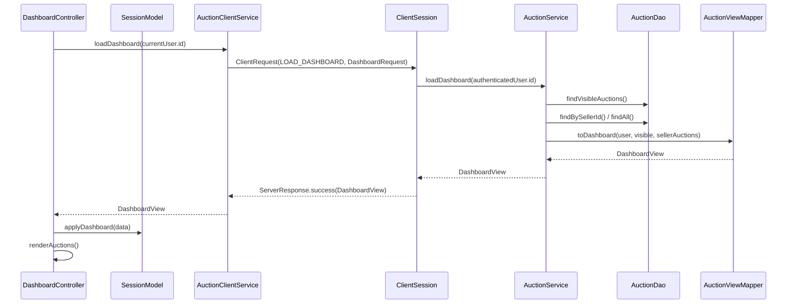
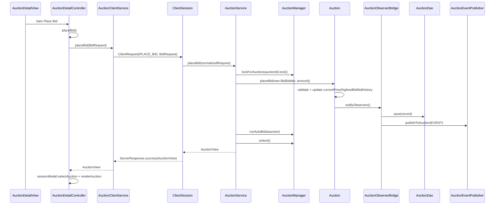
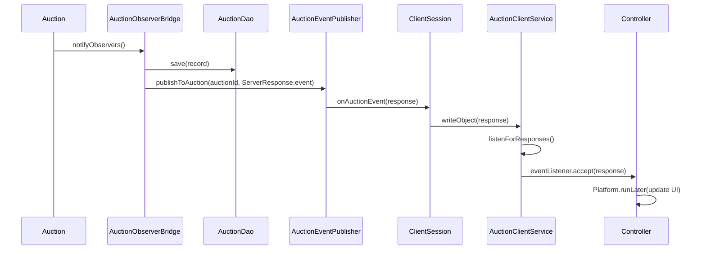

# Flow chay ung dung Auction House

> Comment hoc: File nay dung de hoc "bam nut nao thi goi ham nao". Doc theo tung flow: Controller -> `AuctionClientService` -> socket -> `ClientSession` -> service server -> DAO/domain -> response/event ve UI.

## 1. Khoi dong server

> Comment hoc: Muc nay an diem Client-Server, DAO va persistence. Server khoi dong truoc, doc DB/file, gan observer cho auction da co, roi moi listen socket.

Thu tu:

1. `AuctionServerApplication.main()` xac dinh storage directory.
2. Tao `SqliteAuctionDao`, doc auction tu `auction.db`.
3. Tao `FileBackedUserDao`, doc user tu `users.json`.
4. Tao `AuctionService`; service gan observer cho moi auction da load va dang ky vao `AuctionManager`.
5. Neu chua co auction thi `SampleDataLoader.load()` tao data mau.
6. Tao `AuthenticationService`.
7. Tim port, ghi `active-port.txt`.
8. `AuctionServer.start()` mo `ServerSocket` va cho client ket noi.

Khi co client moi:

1. `AuctionServer.start()` goi `serverSocket.accept()`.
2. Tao `ClientSession(socket, authenticationService, auctionService, eventPublisher)`.
3. Submit `ClientSession` vao `clientPool`.
4. `ClientSession.run()` tao object stream va lap doc `ClientRequest`.

## 2. Khoi dong client va dieu huong man hinh

> Comment hoc: Muc nay an diem MVC JavaFX + FXML. `AppCoordinator` la dieu huong man hinh, controller la noi bat su kien nut bam.

`AppCoordinator` la noi dieu huong man hinh:

- `showLogin()` -> `LoginController`
- `showRegister()` -> `RegisterController`
- `showDashboard(user)` -> `DashboardController`
- `showAuctionDetail(user, auction)` -> `AuctionDetailController`
- `showSeller(user)` -> `SellerController`
- `showAccount(user)` -> `AccountController`

Controller khong tu tao service moi; tat ca dung chung `AuctionClientService` de giu ket noi/session.

## 3. Flow dang nhap

> Comment hoc: Day la flow quan ly nguoi dung. Nut Login goi `LoginController.handleLogin()`, server xu ly bang `AuthenticationService.login()`, user duoc doc tu `UserDao`.

Chi tiet:

1. `LoginController.handleLogin()` doc username/password tu text field.
2. Goi `CompletableFuture.supplyAsync(() -> clientService.login(...))` de khong block JavaFX thread.
3. `AuctionClientService.login()` tao `ClientRequest<>(CommandType.LOGIN, new LoginRequest(...))`.
4. `sendAndAwait()` dam bao socket da ket noi, ghi object qua `ObjectOutputStream`, roi doi response trong `responses.take()`.
5. Tren server, `ClientSession.handleRequest()` switch `LOGIN` -> `handleLogin()`.
6. `AuthenticationService.login()` doc user tu `UserDao`, kiem tra password.
7. Server goi `auctionService.loadDashboard()` de lay `UserView` da map theo role/balance.
8. Client nhan `ServerResponse.success`, `expectPayload()` ep ve `UserView`.
9. `LoginController.finishLogin()` goi `AppCoordinator.showDashboard(user)`.

Du lieu luu o dau:

- Password/user doc tu `users.json` thong qua `FileBackedUserDao`.
- Sau login, client chi giu `UserView` trong controller/session UI.

## 4. Flow dang ky tai khoan

> Comment hoc: Day la flow tao user. Diem can nho: client validate co ban, server moi validate that va ghi user vao `users.json`.

1. `RegisterController.handleRegister()` validate display name, username, password, confirm password, role.
2. Tao `RegisterRequest(username, password, displayName, role, storefrontName)`.
3. Goi `AuctionClientService.register(request)`.
4. Client gui `ClientRequest(CommandType.REGISTER, request)`.
5. `ClientSession.handleRequest()` -> `handleRegister()`.
6. `AuthenticationService.register()`:
   - Kiem tra username/password/displayName.
   - Chan self-register role `ADMIN`.
   - Neu seller thi bat buoc co `storefrontName`.
   - Tao `Seller` hoac `Bidder`.
   - Goi `userDao.save(user)`.
7. `FileBackedUserDao.save()` cap nhat map bo nho va ghi lai `users.json`.
8. Server tra `UserView`.
9. `RegisterController.finishRegister()` hien thong bao thanh cong.

## 5. Flow load dashboard

> Comment hoc: Dashboard khong tu doc DB. No goi server de lay `DashboardView`, sau do `SessionModel.applyDashboard()` dong bo state tam cua UI.

Thu tu trong client:

1. `DashboardController.init()` cau hinh view, dang ky `clientService.setEventListener(this::handleEventResponse)`, goi `loadDashboard()`.
2. `loadDashboard()` goi `clientService.loadDashboard()` trong background thread.
3. Khi co data, `Platform.runLater()` cap nhat UI.
4. `sessionModel.applyDashboard(data)` thay the:
   - `currentUser`
   - `liveAuctions`
   - `sellerAuctions`
   - `metrics`
5. `renderAuctions()` tao card cho tung `AuctionView`.

Phan xu ly nam o dau:

- Loc auction hien thi va auction cua seller: `AuctionService.loadDashboard()`.
- Mapping sang DTO: `AuctionViewMapper.toDashboard()`.
- Render UI: `DashboardController.renderAuctions()`.
- State tam UI: `SessionModel`.

## 6. Flow mo chi tiet auction va subscribe realtime

> Comment hoc: Đây là chỗ realtime bắt đầu. Khi mở chi tiết, controller gọi subscribe; server lưu `ClientSession` vào listener list của auction.

1. User bam card auction tren dashboard.
2. `DashboardController.openAuction(auction)` goi `coordinator.showAuctionDetail(currentUser, auction)`.
3. `AuctionDetailController.init()`:
   - `configureView()`
   - `clientService.setEventListener(this::handleEventResponse)`
   - `sessionModel.selectAuction(auction)`
   - `renderAuction(auction)`
   - `subscribeAndRender(auction)`
4. `subscribeAndRender()` goi `clientService.subscribe(auctionId, currentUser.id)`.
5. Client gui `ClientRequest(SUBSCRIBE_AUCTION, AuctionSubscriptionRequest)`.
6. `ClientSession.handleSubscribe()`:
   - chuan hoa viewer id bang user dang login.
   - `eventPublisher.subscribeToAuction(auctionId, this)`.
   - `auctionService.loadAuction(auctionId)`.
   - tra `AuctionView`.
7. Client render lai chi tiet auction.

Sau khi subscribe, neu auction co bid/status moi, server co the push `ServerResponse.status = EVENT` ve client ma client khong can request truoc.

## 7. Flow dat gia thu cong

> Comment hoc: Đây là flow quan trọng nhất để học chức năng đấu giá. Thứ tự cần thuộc: `placeBid()` ở controller -> `AuctionClientService.placeBid()` -> `ClientSession.handleBid()` -> `AuctionService.placeBid()` -> `Auction.placeBid()` -> observer save/publish.

Thu tu chi tiet:

1. `AuctionDetailController.placeBid()` lay auction dang chon tu `SessionModel`.
2. Kiem tra role phai la `BIDDER`, auction phai `RUNNING`, amount phai >= `minimumNextBid`.
3. Goi `clientService.placeBid(new BidRequest(auctionId, userId, amount))`.
4. Server `ClientSession.handleBid()` thay `bidderId` bang `authenticatedUser.getId()` de client khong gia mao user khac.
5. `AuctionService.placeBid()`:
   - `requireUser()`, `requireAuctionRecord()`.
   - Chan seller cua chinh auction dat gia auction cua minh.
   - Neu user la `Bidder` thi dung truc tiep; neu la `Seller` thi tao `Bidder` tam de bid auction cua nguoi khac.
   - Lay `ReentrantLock` theo `auctionId`.
   - Kiem tra auction phai `RUNNING`.
   - Goi `record.getAuction().placeBid(new Bid(...))`.
6. `Auction.placeBid()`:
   - La `synchronized`.
   - Kiem tra trang thai, duplicate bid, amount toi thieu.
   - Neu con <= 10 giay thi gia han end time them 30 giay va restart scheduler.
   - Cap nhat `item.currentPrice`, `highestBid`, them `BidTransaction`.
   - Goi `notifyObservers()`.
7. `AuctionObserverBridge.update()`:
   - `auctionDao.save(record)` persist auction va bid history.
   - Map sang `AuctionView`.
   - Tao `ServerResponse.event(...)`.
   - `auctionManager.publishToAuction(auctionId, response)`.
8. `AuctionService.placeBid()` tiep tuc goi `auctionManager.runAutoBids(auction)`.
9. Server tra `AuctionView` cho client da dat gia.
10. Nhung client subscribe cung nhan event realtime va goi `handleEventResponse()`.

Dong bo du lieu:

> Comment hoc: Phan nay dung de tra loi cau concurrency: nhieu client cung bid thi server khoa theo `auctionId`, khong khoa toan bo he thong.

- Lock theo auction trong `AuctionService`.
- `Auction.placeBid()` synchronized.
- DAO save synchronized va transaction SQLite.
- Client UI update qua `Platform.runLater()`.

## 8. Flow auto-bid

> Comment hoc: Đây là điểm tùy chọn Auto-Bidding. Rule auto-bid chỉ lưu trong RAM của `AuctionManager`, nhưng các bid tự động khi đã đặt thành công thì vẫn được lưu vào bid history trong SQLite.

1. `AuctionDetailController.setAutoBid()` doc max bid va increment.
2. Validate role bidder, auction running, max bid >= minimum next bid, increment > 0.
3. Gui `ClientRequest(SET_AUTO_BID, AutoBidRequest)`.
4. `ClientSession.handleAutoBid()` chuan hoa bidder id theo user dang login.
5. `AuctionService.setAutoBid()`:
   - Kiem tra user, auction, role, seller khong duoc bid auction cua minh.
   - Lock theo `auctionId`.
   - Goi `auctionManager.setAutoBid(auctionId, bidder, maxBid, increment)`.
   - Goi `auctionManager.runAutoBids(auction)`.
   - `auctionDao.save(record)`.
   - Neu chua co bid tu dong nao ngay lap tuc, publish event "Auto-bid armed".
6. `AuctionManager.runAutoBids()`:
   - Lay rule theo auction.
   - Chon rule co `maxBid` cao nhat, neu bang nhau thi rule tao truoc uu tien.
   - Khong cho nguoi dang highest bid tu nang gia chinh minh.
   - Tinh amount tiep theo bang max cua `auction.bidIncrement` va rule increment.
   - Goi `auction.placeBid()` cho tung bid tu dong.

Luu y persistence:

- Auto-bid rule chi nam trong `AuctionManager.autoBidRules`.
- Bid tu dong sau khi duoc dat thanh cong se vao `Auction.bidHistory` va duoc persist qua observer/DAO.

## 9. Flow tao auction

> Comment hoc: Đây là flow quản lý sản phẩm/auction. Chú ý `ItemFactory` tạo đúng subclass item theo loại hàng, rồi `AuctionService` bọc vào `ManagedAuction` để lưu kèm seller.

1. Seller vao `SellerController`.
2. Bam Create -> `SellerController.createAuction()`.
3. `buildCreateRequest()` lay:
   - item type
   - title
   - description
   - opening price
   - bid increment
   - duration
   - extra value theo loai item
4. Goi `clientService.createAuction(request)`.
5. Server `ClientSession.handleCreateAuction()` chuan hoa seller id theo authenticated user.
6. `AuctionService.createAuction()`:
   - `requireSeller(sellerId)`.
   - Validate item name, starting price, bid increment, duration.
   - `buildItem()` -> parse `ItemType` -> `ItemFactory.createItem(...)`.
   - Tao `Auction(nextAuctionId, item, startTime, endTime, bidIncrement)`.
   - Boc thanh `ManagedAuction(auction, seller, createdAt)`.
   - `attachObserver(record)`.
   - `auctionDao.save(record)` luu SQLite.
   - `auctionManager.registerAuction(record)`.
   - Publish global event `AUCTION_CREATED`.
7. Client nhan `AuctionView`, clear form va load lai danh sach.

## 10. Flow sua, xoa, start, finish auction

> Comment hoc: Muc nay dung de hoc phan quan ly auction cua seller/admin. Quy tac quan trong: sua/xoa chi khi `OPEN`, start chuyen sang `RUNNING`, finish chuyen sang `FINISHED`.

### Sua auction

1. `SellerController.updateAuction()` can `selectedAuction`.
2. Tao `UpdateAuctionRequest`.
3. `AuctionService.updateAuction()`:
   - Kiem tra seller la owner.
   - Chi cho sua khi status `OPEN`.
   - Shutdown scheduler auction cu.
   - Tao item va auction replacement.
   - `record.replaceAuction(replacement)`.
   - Attach observer lai, save DAO, register manager.
   - Publish global `AUCTION_UPDATED`.

### Xoa auction

1. `SellerController.deleteAuction()` gui `DELETE_AUCTION`.
2. `AuctionService.deleteAuction()`:
   - Kiem tra owner hoac admin.
   - Chi cho xoa khi `OPEN`.
   - Shutdown scheduler.
   - `auctionDao.deleteById(auctionId)`.
   - `auctionManager.removeAuction(auctionId)`.
   - Publish global `AUCTION_DELETED`.

### Start auction

1. Tu dashboard hoac seller panel goi `clientService.startAuction(...)`.
2. `AuctionService.startAuction()` kiem tra owner/admin va status `OPEN`.
3. `Auction.startAuction()`:
   - Chuyen status sang `RUNNING`.
   - Set `startTime = now`, tinh lai `endTime`.
   - Start scheduler auto close.
   - `notifyObservers()`.
4. Observer save DB va publish event status changed.

### Finish auction

1. `SellerController.finishAuction()` gui `FINISH_AUCTION`.
2. `AuctionService.finishAuction()` chi cho owner/admin, status phai `RUNNING`.
3. `Auction.closeAuction()` chuyen status `FINISHED`, shutdown scheduler, notify observers.

## 11. Flow nap tien va thanh toan

> Comment hoc: Đây là flow quản lý người dùng và thanh toán. Balance của user nằm trong `User`, nhưng thay đổi được persist bằng `FileBackedUserDao.save()`.

### Nap tien

1. `AccountController.depositFunds()` doc amount tu input.
2. Goi `clientService.depositFunds(amount)`.
3. Client gui `ClientRequest(DEPOSIT_FUNDS, DepositFundsRequest(authenticatedUserId, amount))`.
4. Server `ClientSession.handleDepositFunds()` thay user id bang authenticated user.
5. `AuctionService.depositFunds()`:
   - `requireUser(userId)`.
   - `actor.depositFunds(amount)`.
   - `userDao.save(actor)`.
   - Map sang `UserView`.
6. `FileBackedUserDao.save()` ghi balance moi vao `users.json`.
7. Client cap nhat `currentUser`, wallet label va summary.

### Thanh toan auction thang

1. `AccountController.paySelectedAuction()` lay auction dang chon trong payable list.
2. Kiem tra user la winner, auction chua paid.
3. Goi `clientService.payAuction(auctionId)`.
4. Server `AuctionService.payAuction()`:
   - Actor phai la `Bidder`.
   - Auction phai `FINISHED`, chua `PAID`.
   - Auction phai co `highestBid`.
   - Actor id phai bang winner id.
   - `bidder.withdrawFunds(currentPrice)`.
   - `userDao.save(bidder)` luu balance moi.
   - `auction.markPaid()`.
5. `Auction.markPaid()` notify observer.
6. Observer save auction vao SQLite va publish event.
7. Client load lai account data.

## 12. Flow realtime event

> Comment hoc: Đây là điểm Observer/Socket. Server không cần client hỏi lại; khi auction đổi, observer publish `ServerResponse.event`, client listener thread nhận rồi cập nhật UI bằng `Platform.runLater()`.

Client phan biet response:

- `ResponseStatus.EVENT`: la server push, khong phai ket qua cua request dang doi. `AuctionClientService.listenForResponses()` goi `eventListener.accept(response)`.
- Response khac `EVENT`: dua vao queue `responses.offer(response)` de `sendAndAwait()` lay ra.

Controller xu ly event:

- `DashboardController.handleEventResponse()`: neu co event thi load lai dashboard.
- `AuctionDetailController.handleEventResponse()`: neu payload la auction dang xem thi update `SessionModel` va render lai.
- `AccountController.handleEventResponse()`: load lai account data.

## 13. Noi xu ly, noi luu va state theo tung tang

> Comment hoc: Bảng này dùng để trả lời câu "phần nào xử lí, chuyển cho phần nào, đối tượng nào thực hiện, lưu ở đâu".

| Tang | Lop chinh | Nhiem vu | State/luu tru |
| --- | --- | --- | --- |
| UI | FXML | Hien thi field, button, list, chart | Khong luu nghiep vu |
| Controller | `LoginController`, `DashboardController`, `AuctionDetailController`, `SellerController`, `AccountController` | Doc input, validate co ban, goi service, render UI | State man hinh tam |
| Client service | `AuctionClientService` | Quan ly socket, send/await response, lang nghe realtime event | Socket, stream, queue response, authenticatedUserId |
| Protocol | `ClientRequest`, request records, `ServerResponse` | Dong goi lenh va payload qua socket | Serializable object |
| Network server | `AuctionServer`, `ClientSession` | Accept socket, doc request, dispatch theo command, send response/event | Authenticated user cua session |
| Business service | `AuthenticationService`, `AuctionService` | Xac thuc, phan quyen, nghiep vu auction/bid/payment | Khong luu truc tiep, thao tac qua DAO/domain |
| Domain | `Auction`, `Item`, `User`, `Bid` | Luat nghiep vu cot loi | State auction/user trong object |
| Manager | `AuctionManager` | Singleton registry, lock, auto-bid, active sessions | In-memory server-wide |
| Event | `AuctionObserverBridge`, `AuctionEventPublisher` | Persist khi auction doi va push realtime | Listener sets |
| DAO | `SqliteAuctionDao`, `FileBackedUserDao` | Doc/ghi du lieu ben vung | SQLite + JSON |

## 14. Tom tat dong bo du lieu

> Comment hoc: Nếu chỉ có 1 phút trình bày concurrency/realtime, học thuộc 6 gạch đầu dòng này.

- Request/response binh thuong la dong bo theo tung request: client gui request va `sendAndAwait()` doi response.
- UI khong bi block vi controller boc loi goi service trong `CompletableFuture`.
- JavaFX UI chi duoc cap nhat trong `Platform.runLater()`.
- Realtime event la bat dong bo: server push `ServerResponse.event`, client listener thread nhan va day cho controller.
- Bid duoc serialize theo auction bang `ReentrantLock` va `synchronized placeBid()`.
- Auction thay doi thi observer tu dong save DB va publish event.
- User balance thay doi thi `FileBackedUserDao.save()` ghi JSON ngay.
