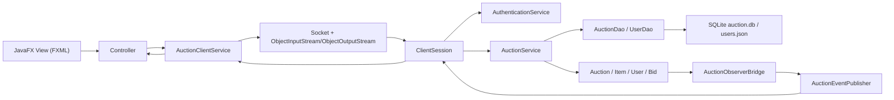
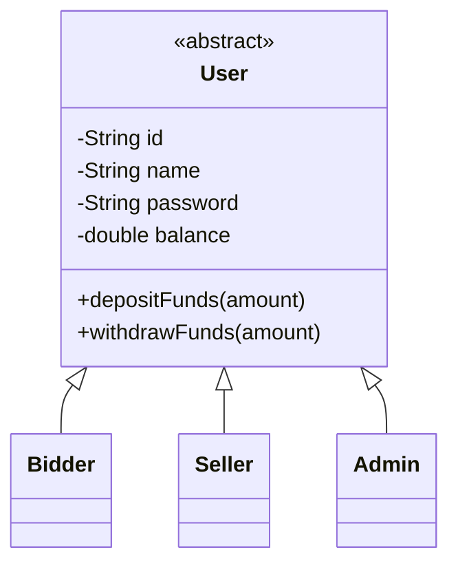
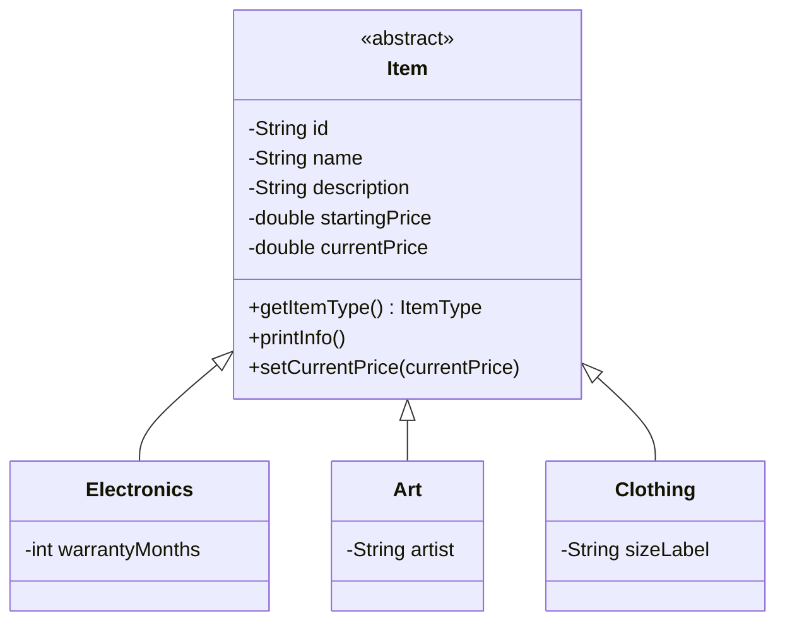
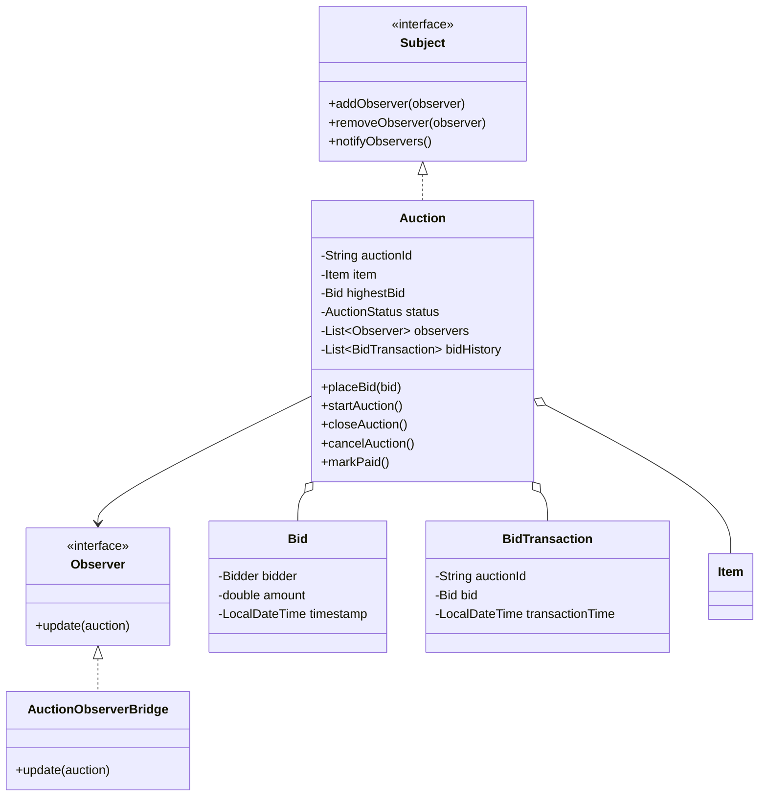
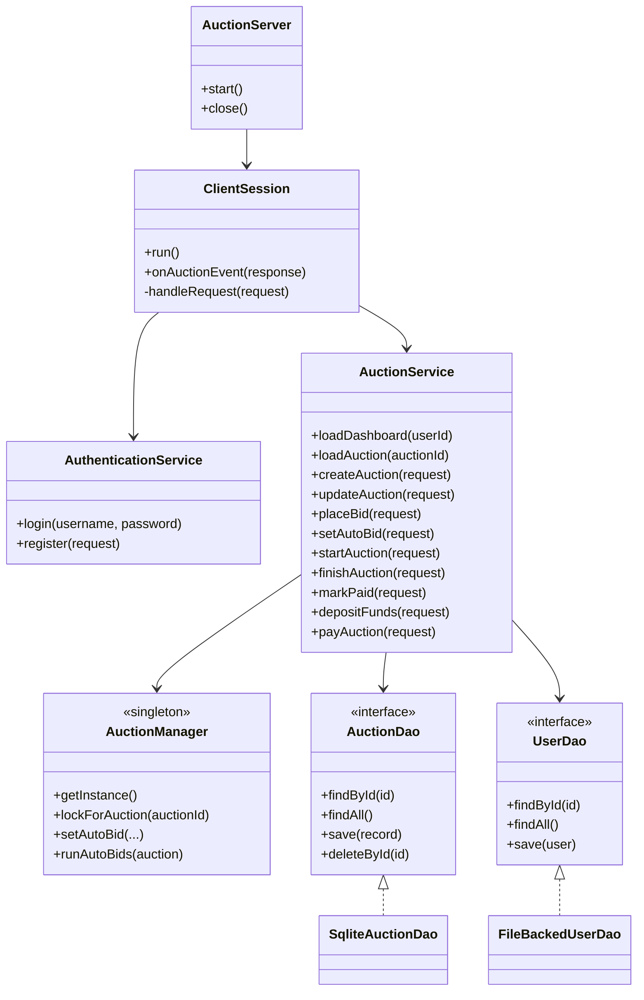

# Note Codex - Auction House

## 0. Bang cham diem theo rubric

> Comment hoc: Bang nay dung de tu cham va on van dap. Khi thay co thay/co hoi dong hoi "muc nay nam o dau?", hay chi vao cot Bang chung va cac section duoi.

| Noi dung | Diem | Muc | Danh gia | Bang chung trong code/docs |
| --- | ---: | --- | ---: | --- |
| Thiet ke lop va cay ke thua | 0.5 | Bat buoc | 0.5/0.5 | `User` -> `Bidder/Seller/Admin`; `Item` -> `Electronics/Art/Clothing`; xem section 2.1, 2.2 |
| Ap dung OOP: Encapsulation, Inheritance, Polymorphism, Abstraction | 1.0 | Bat buoc | 1.0/1.0 | Abstract class `User`, `Item`; interface `Subject`, `Observer`, `AuctionDao`, `UserDao`; private fields + getter/method nghiep vu |
| Design Patterns phu hop | 1.0 | Bat buoc | 1.0/1.0 | MVC, Singleton, Observer, Factory, DAO/Repository, DTO/Protocol, Mapper; xem section 3 |
| Quan ly nguoi dung, san pham | 1.0 | Bat buoc | 1.0/1.0 | `AuthenticationService`, `FileBackedUserDao`, `User`; `ItemFactory`, `Item`, `AuctionService.createAuction/updateAuction` |
| Chuc nang dau gia | 1.0 | Bat buoc | 1.0/1.0 | Dat gia, tao/sua/xoa/start/finish/cancel/mark paid/pay auction trong `AuctionService`, `Auction` |
| Xu ly loi va ngoai le | 1.0 | Bat buoc | 1.0/1.0 | Exception rieng: `AuthenticationException`, `InvalidBidException`, `AuctionClosedException`, `UnauthorizedActionException`; `ServerResponse.error` |
| Xu ly dau gia dong thoi (concurrency) | 1.0 | Bat buoc | 1.0/1.0 | `ReentrantLock` theo auction trong `AuctionManager`; `Auction.placeBid()` synchronized; `ConcurrentHashMap`, `CopyOnWriteArraySet` |
| Realtime update (Observer/Socket) | 0.5 | Bat buoc | 0.5/0.5 | `Auction` notify observer -> `AuctionObserverBridge` -> `AuctionEventPublisher` -> `ClientSession` -> socket event |
| Kien truc Client-Server | 0.5 | Bat buoc | 0.5/0.5 | `AuctionClientService` gui request qua socket; `AuctionServer` accept; `ClientSession` dispatch command |
| MVC (JavaFX + FXML, Controller-Model-DAO) | 0.5 | Bat buoc | 0.5/0.5 | FXML view, controller JavaFX, `SessionModel`, server DAO; xem section 3.1 |
| Maven/Gradle, coding convention | 0.5 | Bat buoc | 0.5/0.5 | Multi-module Maven `pom.xml`; Checkstyle plugin va `config/checkstyle/checkstyle.xml` |
| Unit Test (JUnit) | 0.5 | Bat buoc | 0.5/0.5 | JUnit tests trong `auction-shared`, `auction-server`, `auction-client` |
| CI/CD (GitHub Actions) | 0.5 | Bat buoc | 0.5/0.5 | `.github/workflows/maven.yml`, `.github/workflows/checkstyle.yml` |
| Auto-Bidding | 0.5 | Tuy chon | 0.5/0.5 | `AuctionManager.setAutoBid/runAutoBids`, `AuctionService.setAutoBid`, `AuctionDetailController.setAutoBid` |
| Anti-sniping | 0.5 | Tuy chon | 0.5/0.5 | `Auction.placeBid()` gia han 30 giay neu con <= 10 giay |
| Bid History Visualization | 0.5 | Tuy chon | 0.5/0.5 | `AuctionDetailController.renderBidChart()`, `bidHistoryListView` |
| Tong | 10 + 1 | Bat buoc + tuy chon | 10/10 + 1/1 | Diem tuy chon co du 1.5/1.5 ve mat tinh nang; neu rubric gioi han tong la `10+1` thi lay toi da +1 |

> Comment hoc: Neu giao vien cham theo tong toi da 11, bai nay co the trinh bay la `10/10 bat buoc + 1/1 diem cong tuy chon`. Neu giao vien cong thang ca 3 muc tuy chon, co the noi raw optional la `1.5/1.5`.

## 1. Tong quan kien truc

> Comment hoc: Muc nay an diem "Kien truc Client-Server" va "MVC". Khi giai thich, noi client chi hien thi/nhan input, server moi xu ly nghiep vu va luu database.

Du an chia thanh 3 module chinh:

- `auction-client`: ung dung JavaFX, gom FXML, controller, `AuctionClientService`, `SessionModel`, `AppCoordinator`.
- `auction-server`: server socket, service nghiep vu, DAO, event publisher va persistence.
- `auction-shared`: model domain, DTO, enum, request/response protocol dung chung giua client va server.

Kien truc tong quat:

## 2. Diagram cac lop chinh va quan he ke thua

> Comment hoc: Muc nay an diem "Thiet ke lop va cay ke thua". Can nhan manh 2 cay ke thua quan trong la `User` va `Item`; `Auction` khong ke thua ma compose `Item`, `Bid`, `BidTransaction`.

### 2.1. Model nguoi dung

`User` la lop tong quat vi tat ca tai khoan deu co `id`, `name`, `password`, `balance`. Cac lop con the hien vai tro:

- `Bidder`: dat gia, nap tien, thanh toan phien thang.
- `Seller`: tao/sua/xoa/bat dau/ket thuc phien cua minh; code hien tai cung cho seller tham gia bid phien khac bang cach tao tam `Bidder`.
- `Admin`: thao tac quan tri nhu `markPaid`, `cancelAuction`, quan ly tat ca auction.

### 2.2. Model san pham dau gia

> Comment hoc: Day la phan de noi ve Abstraction + Polymorphism: UI/service chi co the lam viec voi kieu `Item`, nhung luc runtime doi tuong that co the la `Electronics`, `Art` hoac `Clothing`.

`Item` gom cac truong va hanh vi chung cua mon hang. Moi loai hang chi them phan thong tin rieng:

- `Electronics`: bao hanh theo thang.
- `Art`: ten nghe si.
- `Clothing`: size.

### 2.3. Auction, bid va observer

> Comment hoc: Day la phan quan trong nhat de bao ve diem "Chuc nang dau gia", "Realtime update" va "Observer". `Auction` xu ly luat dat gia, con observer giup tu dong luu DB va push event.

`Auction` la doi tuong trung tam cua nghiep vu dau gia. No tu quan ly:

- Trang thai phien: `OPEN`, `RUNNING`, `FINISHED`, `PAID`, `CANCELED`.
- Gia hien tai thong qua `Item.currentPrice`.
- Gia cao nhat `highestBid`.
- Lich su bid `bidHistory`.
- Timer tu dong dong phien qua `ScheduledExecutorService`.
- Thong bao thay doi qua `Subject.notifyObservers()`.

### 2.4. Server service, DAO va network

> Comment hoc: Day la phan noi ro Controller-Model-DAO va Client-Server. `ClientSession` chi dieu phoi request, `AuctionService` xu ly nghiep vu, `AuctionDao/UserDao` lo luu tru.

## 3. Design pattern dang dung va ly do

> Comment hoc: Muc nay an 1 diem design pattern. Khi trinh bay khong chi ke ten pattern, phai noi "tai sao dung class do", vi rubric ghi day la phan quan trong.

### 3.1. MVC / Presentation separation

Ap dung o client:

- View: cac file FXML nhu `LoginView.fxml`, `DashboardView.fxml`, `AuctionDetailView.fxml`.
- Controller: `LoginController`, `DashboardController`, `AuctionDetailController`, `SellerController`, `AccountController`.
- Model phia UI: `SessionModel`, DTO nhu `AuctionView`, `DashboardView`, `UserView`.

Ly do dung:

- Tach giao dien khoi xu ly su kien.
- Controller chi dieu phoi: doc input, goi `AuctionClientService`, cap nhat UI.
- `SessionModel` giu state hien tai cua man hinh, giup list auction va bid history co the refresh theo response moi.

### 3.2. Singleton - `AuctionManager`

> Comment hoc: Neu bi hoi vi sao khong tao nhieu `AuctionManager`, tra loi: vi lock, auto-bid rule va danh sach auction/session phai la state dung chung toan server.

`AuctionManager.getInstance()` tao mot instance dung chung toan server.

Ly do dung class nay:

- Can mot noi quan ly registry auction dang chay, lock tung auction, session dang active va auto-bid rules.
- Neu moi service/session tao manager rieng thi lock va auto-bid khong dong bo, de xay ra race condition.
- Singleton phu hop vi day la state dieu phoi server-wide.

### 3.3. Observer - `Subject`, `Observer`, `Auction`, `AuctionObserverBridge`

> Comment hoc: Diem hay cua pattern nay la `Auction` khong phu thuoc vao socket hay DB. No chi notify; bridge va publisher tu xu ly persist/realtime.

`Auction` implements `Subject`. Khi bid moi, start/close/cancel/mark paid, `Auction` goi `notifyObservers()`. `AuctionObserverBridge.update()` nhan su kien, luu lai DAO va publish event realtime.

Ly do dung:

- `Auction` khong can biet UI, socket hay database hoat dong ra sao.
- Logic domain chi can bao "toi da thay doi".
- Bridge chuyen thay doi domain thanh hanh dong ha tang: persist va push event cho client.

### 3.4. Factory Method / Simple Factory - `ItemFactory`

> Comment hoc: Neu hoi tai sao dung factory, noi vi viec tao item phu thuoc `ItemType`; neu de service `new Electronics/new Art/new Clothing` o nhieu noi thi code bi lap va kho mo rong.

`ItemFactory.createItem(type, ...)` tao dung subclass:

- `ELECTRONICS` -> `Electronics`
- `ART` -> `Art`
- `CLOTHING` -> `Clothing`

Ly do dung:

- `AuctionService` khong phai new tung class item o nhieu noi.
- Logic tao item theo `ItemType` tap trung mot cho.
- Khi them loai item moi, chi can them enum, class con va case trong factory.

### 3.5. DAO / Repository - `AuctionDao`, `UserDao`

> Comment hoc: DAO giup an diem MVC/DAO va persistence. `AuctionService` chi goi interface, nen test co the dung in-memory DAO, chay that thi dung SQLite/JSON.

`AuctionService` lam viec voi interface `AuctionDao`, `UserDao`, khong phu thuoc truc tiep vao SQLite hay file JSON.

Implement hien tai:

- `SqliteAuctionDao`: luu auction va bid history vao SQLite.
- `FileBackedUserDao`: luu user vao `users.json`.
- `InMemoryAuctionDao`, `InMemoryUserDao`: phu hop test.

Ly do dung:

- Tach nghiep vu khoi persistence.
- De thay doi cach luu tru ma khong sua service.
- Test co the dung DAO in-memory, khong can database that.

### 3.6. DTO va protocol object

> Comment hoc: DTO/protocol giup phan Client-Server ro rang: khong gui lung tung object UI, ma gui request/response co kieu lenh va payload.

Client/server truyen:

- `ClientRequest<T>`: gom `CommandType` va payload request.
- `ServerResponse<T>`: gom status, message, payload.
- DTO: `AuctionView`, `DashboardView`, `UserView`, `ItemView`, `BidView`.

Ly do dung:

- Khong gui truc tiep domain object day du cho UI.
- Giam phu thuoc giua client va server.
- Response co the phan biet `SUCCESS`, `ERROR`, `EVENT`.

### 3.7. Command dispatch - `CommandType` + `ClientSession.handleRequest`

> Comment hoc: Co the xem day la cach ap dung y tuong Command o muc dispatch: moi thao tac UI bien thanh mot `CommandType`, server switch de goi dung handler.

Moi thao tac client duoc bieu dien bang mot command:

- `LOGIN`, `REGISTER`, `LOAD_DASHBOARD`
- `PLACE_BID`, `SET_AUTO_BID`
- `CREATE_AUCTION`, `START_AUCTION`, `PAY_AUCTION`

`ClientSession.handleRequest()` switch theo `CommandType` va goi dung handler.

Ly do dung:

- Mot socket co the phuc vu nhieu loai request.
- De doc luong dieu phoi: command nao goi service nao.
- Khi them chuc nang moi, them `CommandType`, request class va handler.

### 3.8. Mapper - `AuctionViewMapper`

> Comment hoc: Mapper giup tach domain va view. Khi cham OOP/MVC, day la bang chung code khong tron domain object voi du lieu hien thi.

`AuctionViewMapper` chuyen domain object (`ManagedAuction`, `Auction`, `User`) thanh DTO view.

Ly do dung:

- Tach domain khoi du lieu hien thi.
- Client nhan du lieu gon, serializable, dung truc tiep cho UI.
- Tranh lap code mapping trong nhieu service method.

## 4. Dong bo du lieu va tranh tranh chap

> Comment hoc: Muc nay an diem concurrency. Noi ngan gon: lock o service de tranh 2 thread bid cung luc; synchronized trong domain de bao ve state noi bo; collection concurrent de publish event an toan.

- `Auction.placeBid()` la `synchronized`, bao ve state noi bo cua auction.
- `AuctionService.placeBid()` va `setAutoBid()` dung `ReentrantLock` theo `auctionId` tu `AuctionManager.lockForAuction()` de serialize cac thao tac bid tren cung mot phien.
- `AuctionEventPublisher` dung `CopyOnWriteArraySet` va `ConcurrentHashMap` de publish realtime an toan khi nhieu client ket noi.
- `SqliteAuctionDao.save()` la `synchronized`, khi luu auction se upsert auction va replace bid history trong transaction SQLite.
- `FileBackedUserDao.save()` la `synchronized`, ghi snapshot user ra JSON.

## 5. Noi luu thong tin

> Comment hoc: Muc nay an diem quan ly nguoi dung/san pham va DAO. Phan can nho: auction luu SQLite, user/balance luu JSON, auto-bid rule chi nam trong RAM.

- Auction, item, highest bid, bid history: `auction-server/data/auction.db` hoac `data/auction.db` tuy thu muc chay server.
- User, role, password, balance: `auction-server/data/users.json` hoac `data/users.json`.
- Port server dang dung: `active-port.txt` trong storage directory.
- State tam tren client: `SessionModel`, chi nam trong bo nho UI, khi refresh se load lai tu server.
- Auto-bid rules: `AuctionManager.autoBidRules`, chi nam trong bo nho server, khong persist xuong DB.
